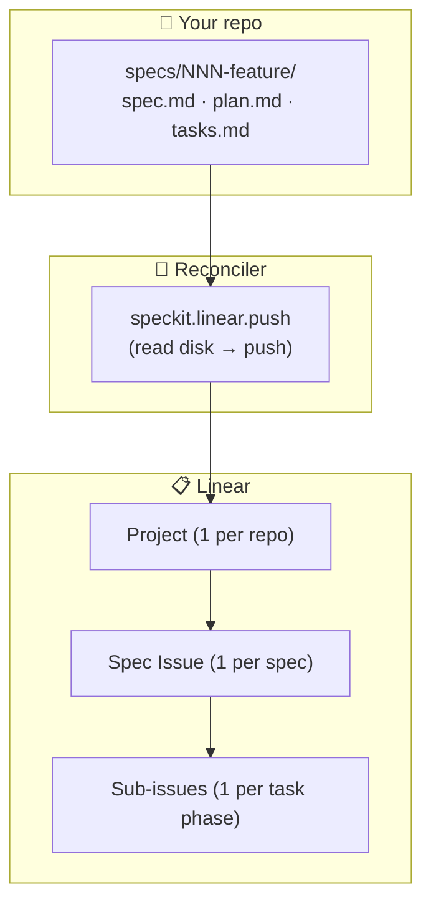
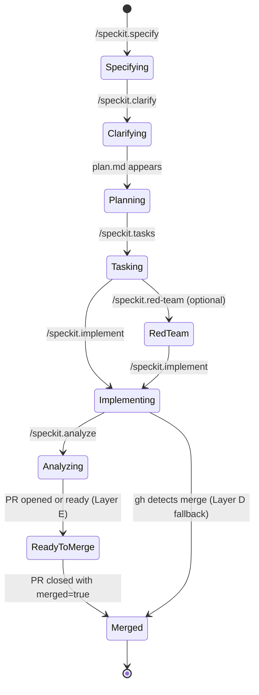

# Linear — a Spec Kit extension

**Keep Linear in sync with your spec-driven project, automatically.** Every spec on disk becomes a Linear issue (and every task phase a sub-issue), so you can see — and steer — every active spec across every repo from one place. You keep working in your files as usual; the bridge mirrors them into Linear for you and keeps it current as you plan, build, and merge. Your files stay the single source of truth — Linear is the always-up-to-date view, never something you edit by hand.

- **Version:** 0.8.0
- **Repository:** <https://github.com/ashbrener/spec-kit-linear-sync>
- **License:** MIT
- **Requires:** Spec Kit ≥ 0.1.0 · bash 4+ · `curl` · `jq` · `gh` (optional) · `git`
- **Commands:** `/speckit.linear.install`, `/speckit.linear.seed`, `/speckit.linear.push`, `/speckit.linear.pull`, `/speckit.linear.status` (auto-invoked on every `/speckit.*` lifecycle command)

## Why a Linear bridge

You're running spec-kit in four repos at once. Each repo has its own `specs/NNN-feature/` tree, its own feature branch, its own worktree somewhere on disk. The filesystem holds every fact perfectly — your head does not.

| Situation | Without the bridge | With the bridge |
|---|---|---|
| Which spec is in which phase across which repo? | Open four shells; `find`; remember which branch each spec lives on | One Linear view, every active spec stack-ranked by phase |
| Did the last clarify session ratify? | Re-grep `## Clarifications` in `spec.md` | Linear comment on the spec Issue per `### Session YYYY-MM-DD` |
| Which worktree owns this spec right now? | `git worktree list` + cross-reference branches | Memory block on the spec Issue's description |
| PR landed — is Linear in sync? | Manual edit | GitHub Action flips the Issue to `Merged` within a minute |

The extension turns each spec into a real Linear Issue with phase, branch, worktree pointer, current task, and clarify history visible at a glance. No daemons, no databases, no reverse-sync surprises.

## How it works



1. The extension installs an `after_*` hook for every `/speckit.*` lifecycle command. Every time you specify, clarify, plan, tasks, implement, or analyze, the hook fires `/speckit.linear.push`.
2. `push` reads every `specs/NNN-feature/` directory on disk, infers the spec's lifecycle phase from artifact presence (per FR-012), and idempotently writes to Linear: spec Issue title + description (the spec's own `Input` + `## Overview` + body inlined and size-capped, plus the bridge-owned memory block, plus a link to the full spec — spec 006), sub-issue per task phase (with checklist mirror), blocking relations, clarify-session comments, `phase:*` / `task-phase:*` / `speckit-spec:NNN` labels.
3. Local git hooks (`post-checkout`, `post-commit`, `post-merge`) also fire the reconciler, so branch switches and ticked-off tasks land in Linear without re-running a spec-kit command.
4. A shipped GitHub Action (`spec-kit-linear-sync.yml`) listens for PR events and flips the spec Issue to `Ready-to-merge` and `Merged` in real time — even when your laptop is closed.
5. The reconciler is **filesystem-driven**: it never reads Linear state and writes back to disk. Linear is the mirror; the markdown wins every conflict.

## Install

The extension is listed in the spec-kit community catalog, so the canonical install is the short form:

```bash
specify extension add linear
```

Two alternatives are available when you need them:

**From the GitHub archive URL** (the CLI's `--from` flag expects a direct ZIP, not a repo URL) — useful for pinning to a branch or release before the catalog refreshes:

```bash
specify extension add linear --from https://github.com/ashbrener/spec-kit-linear-sync/archive/refs/heads/main.zip
```

**From a local checkout** (symlinks rather than copies, so your local edits flow through) — useful when developing the bridge itself:

```bash
specify extension add /path/to/spec-kit-linear-sync --dev
```

Run this from a **separate consumer repo**, not from inside the bridge's own checkout. The install detects source-equals-target and halts with exit 2 (FR-046) rather than copy the bridge into itself.

Either path registers the `after_*` hooks into your project's `.specify/extensions.yml`, drops local git hooks into `.git/hooks/`, scaffolds the committed `.specify/extensions/linear/linear-config.yml`, and creates the gitignored `.specify/extensions/linear/linear-operator.local.yml` for your identity.

If the install reports a vendored `.git/` warning under `.specify/extensions/linear/`, run `rm -rf .specify/extensions/linear/.git` and re-run the install (FR-049). The bridge does not auto-delete that directory — operator consent is required.

### Updating (and restoring hooks after a `--force` update)

Community extensions have no frictionless `specify extension update`, so the update path is a pinned `--from <release-zip> --force` reinstall:

```bash
# Pin to the latest release tag (replace <X.Y.Z>, e.g. v0.8.0):
specify extension add linear \
  --from https://github.com/ashbrener/spec-kit-linear-sync/archive/refs/tags/v<X.Y.Z>.zip \
  --force
```

> **`--force` strips your `after_*` auto-sync hooks.** The CLI's `--force` reinstall removes the bridge's six `after_*` hook registrations from `.specify/extensions.yml`, so auto-sync silently stops. **After any `--force` update, re-run `/speckit.linear.install`** to re-register them. The bridge also self-reports this: the next `/speckit.linear.push` (or `/speckit.linear.status`) loudly names the missing hooks and points at the same fix, and — in an interactive session — offers to re-register them in place (spec [`014-hook-health`](./specs/014-hook-health/spec.md)).

## Adopt — the 3 steps every project takes

1. **Run `/speckit.linear.install`.** This is the interactive install ceremony. It resolves your Linear Team UUID (auto-picks if your workspace has one team; prompts otherwise), creates or attaches a Linear Project for this repo, writes the shareable binding to `.specify/extensions/linear/linear-config.yml` (committed so collaborators inherit it), captures your operator identity via Linear's `viewer` query and writes it to the gitignored `.specify/extensions/linear/linear-operator.local.yml`, and optionally installs the GitHub Action layer.

2. **Run `/speckit.linear.seed`.** One-shot setup — creates the 9 lifecycle workflow states (`Specifying`, `Clarifying`, `Planning`, `Tasking`, `Red-team`, `Implementing`, `Analyzing`, `Ready-to-merge`, `Merged`), the 9 `phase:*` labels, and `task-phase:1`..`task-phase:9`. Captures every UUID at creation and writes it back into `linear-config.yml` (per FR-032) so renames in Linear's UI never break the bridge.

   **No workspace-admin? You can still seed (spec [`005-team-scoped-seeding`](./specs/005-team-scoped-seeding/spec.md), v0.3.0).** The seed takes a `--scope workspace|team` option (default `team`): team scope creates the workflow states **and** labels scoped to your configured team, needing only team-level permissions — never workspace-admin. If an admin (or a prior run) already created the resources, the **adopt-existing** path captures their UUIDs into config by name instead of creating them, so you need no create permission at all. When a create call hits a permission/limit error, the seed surfaces an actionable message naming the resource and pointing you at the adopt / team-scoped path rather than hard-failing. The captured config is identical in shape regardless of scope or path, and re-seeding stays idempotent (0 `created` events).

3. **Use spec-kit as normal.** Every `/speckit.specify`, `.clarify`, `.plan`, `.tasks`, `.implement`, `.analyze` now fires `/speckit.linear.push` automatically. The first run for any pre-existing spec backfills retroactively — Linear converges to the correct end-state without producing spurious intermediate-phase comments (FR-014).

## Usage

The five command surface:

| Command | Direction | Description |
|---|---|---|
| `/speckit.linear.install` | install-time only | Resolves Team / Project UUIDs, writes the committed `linear-config.yml`, scaffolds the gitignored `linear-operator.local.yml` (your identity), registers hooks, optionally installs the GitHub Action. |
| `/speckit.linear.seed` | workspace / team setup | Creates lifecycle workflow states + labels. Takes `--scope workspace\|team` (default `team`); a non-admin operator can seed via team-scoped create or the **adopt-existing** path (captures UUIDs of resources an admin already made). Idempotent; safe to re-run. (spec 005) |
| `/speckit.linear.push` | disk → Linear (write) | The reconciler. Fires automatically on every `/speckit.*` hook; also invokable on demand. |
| `/speckit.linear.pull` | Linear → terminal (read-only) | Cross-repo unified inspect. Surfaces every spec Issue across every repo bound to the workspace. |
| `/speckit.linear.status` | terminal (read-only) | Drift report — per spec, flags mismatches between disk and Linear (lifecycle, branch, last-touched, checklist completion). |

### Examples

**Manual reconcile of one spec — usually unnecessary, but useful for recovery:**

```bash
/speckit.linear.push --spec 003
```

**Reconcile every spec in this repo:**

```bash
/speckit.linear.push --all
```

**Dry-run — print what would change, mutate nothing:**

```bash
/speckit.linear.push --all --dry-run
```

**Inspect what Linear thinks about every spec in this repo:**

```bash
/speckit.linear.status --all
```

**Cross-repo: every spec across every repo bound to your Linear workspace:**

```bash
/speckit.linear.pull --workspace-wide
```

## What lands in Linear

Spec-kit artifacts map to Linear primitives one-to-one:

| Filesystem | Linear primitive |
|---|---|
| Consumer repository | **Project** (1 per repo, stamped with the repo's directory name) |
| Spec (`specs/NNN-feature/`) | **Issue** under that Project, titled `<NNN> — <name>` from the spec's `# Feature Specification:` H1 (falling back to the `**Input**:` lede, then the dir slug — spec 012; deterministic, default-on), identified by the workspace label `speckit-spec:NNN` (FR-004b) |
| Spec content (`Input` + `## Overview` + body) | Inlined into the Issue **description** so the issue is self-contained — size-capped, truncated at a clean boundary when oversized, always with a link to the full spec (v0.3.0, spec [`006-faithful-projection`](./specs/006-faithful-projection/spec.md)). Idempotent: an unchanged spec produces no description churn. |
| Lifecycle phase (`Specifying` / `Clarifying` / …) | Workflow state on the spec Issue + `phase:*` label |
| Task phase (`## Phase N <sep> <Name>` block in `tasks.md`) | **Sub-issue** under the spec Issue, with `task-phase:N` label. As of v0.3.0 `push` accepts `:`, `—` (em-dash), `-`, or whitespace after `## Phase N` — all produce the same sub-issue (spec [`006-faithful-projection`](./specs/006-faithful-projection/spec.md)); a `## Phase` line with no extractable number still raises a near-miss warning. The index may be a number **or a single letter** (`## Phase A —`, mapped A→1; spec 013); a sub-issue's workflow state tracks the `tasks.md` checkbox ratio **until the spec is `ready_to_merge`/`merged`, when every phase is driven to Done** so the board matches the merged work (spec 013). |
| Tasks within a phase | **Markdown checklist** in the sub-issue's description (read-only mirror per FR-006) |
| Inter-task-phase ordering | Linear **blocking relations** between sub-issues |
| Each `### Session YYYY-MM-DD` clarify block | **Comment** on the spec Issue, one per session |
| Each `## D<N>`/`## R<N>` decision block in `research.md` | **ADR comment** on the spec Issue, one per decision (id, title, status, decision, rationale, alternatives, source) — idempotent and updated in place when the decision changes (spec 008) |
| Branch / worktree / last-touched / current task | **Memory block** — a markdown table in the spec Issue's description, fully bridge-owned (rewritten every reconcile per FR-004). Operator annotations go in Linear **comments**, never the description body. |
| Optional `[N]` Fibonacci marker on a task line | Per-phase sum → sub-issue `estimate`; spec-level sum → spec Issue `estimate` (FR-035) |
| Spec author (opt-in) | `author:<handle>` **label** on the spec Issue, plus the author as **assignee** on create when they're a Linear member (spec 010 — see [Author attribution](#author-attribution-optional)) |

Lifecycle phases on the spec Issue's workflow state:



## Configurable mapping (optional)

> **Status:** opt-in / newer feature — the default path is the well-trodden one.
> Validate on a test workspace before enabling in production.

### Default mapping — unchanged and frozen

With no `mapping:` block in `linear-config.yml`, the bridge mirrors spec-kit
levels to Linear primitives exactly as it always has, byte-for-byte:

| Spec-kit level | Linear artifact | Parent relationship |
|---|---|---|
| Repository | **Project** | (top level) |
| Spec (`specs/NNN-…/`) | **Issue** | under Project |
| Task phase (`## Phase N`) | **Sub-issue** | under Issue |
| Tasks within a phase | **Checklist** | inside sub-issue description |

Existing installs are completely unaffected — no config change needed.

### Opt-in `mapping:` block

Add a `mapping:` block to `.specify/extensions/linear/linear-config.yml` to
choose, per spec-kit level, the Linear artifact and its parent relationship.

**Headline example — spec as Project (resolves design issue #17):**

```yaml
mapping:
  levels:
    repo:
      artifact: "Initiative"
      relationship_to_parent: "none"
    spec:
      artifact: "Project"
      relationship_to_parent: "parent"
    phase:
      artifact: "Issue"
      relationship_to_parent: "parent"
    task:
      artifact: "sub-issue"
      relationship_to_parent: "parent"
```

Result: `Initiative > Project > Issue > sub-issue` — Linear's real hierarchy.
Projects cannot nest under Projects, so a spec-as-Project must sit under a
repo-level Initiative. The bridge creates the Initiative automatically if one
does not already exist for the repo.

This mirrors the configurable-mapping grammar shipped in the sibling
`spec-kit-jira` extension (`specs/002-configurable-mapping`).

### Optional L0 narrative super-level

```yaml
mapping:
  l0:
    enabled: true
```

When `l0.enabled` is `true`, the bridge creates a Linear **Initiative** above
the repo level as a narrative container. Its description is sourced exclusively
from the spec's `**Input**:` line — the one-sentence statement of intent at the
top of `spec.md`. This level carries no lifecycle state of its own.

- **Off by default.** Omitting `l0` or setting `enabled: false` folds the
  narrative onto the repo-level artifact as before.
- **Degrades gracefully.** Where Initiatives are not available on the Linear
  plan, the bridge falls back silently to the repo-level Project and emits a
  one-line notice — it does not fail the reconcile.

### Validation — fail-closed at config-load

The bridge validates the entire `mapping:` block before writing a single byte
to Linear. Rejected configurations include:

- Dependency links used as nesting relationships (e.g. `blocking` in place of
  `parent`).
- `relationship_to_parent: "none"` on any level below the top.
- Checklist misuse — only the `task` level may map to `checklist`.
- Linear-impossible nestings (e.g. Project nested under Project).

A rejected config surfaces a descriptive error naming the offending field and
halts the reconcile. No partial writes occur.

### Identity marker

Initiative and Project artifacts written by the bridge carry a
`<!-- speckit-id: PLACEHOLDER_UUID -->` marker in their description. The
reconciler uses this marker for idempotent re-matching across renames — if you
rename the Initiative or Project in Linear's UI, the bridge still finds the
correct artifact on the next reconcile. Do not delete that line.

## Author attribution (optional)

> **Status:** opt-in / newer feature (spec 010). Default OFF — doing nothing
> changes nothing. Validate on a test workspace before enabling in production.

By default the bridge assigns every spec Issue (and its sub-issues) to the
**operator** — the person whose key ran the sync (FR-034). On a shared install
that means every spec shows one person. Enable **author attribution** to make the
board reflect **who authored each spec** instead.

Two independent tracks, both opt-in:

- **`author:<handle>` label** — always stamped, account-independent (works for
  authors with no Linear account).
- **Assignee** — the spec Issue is assigned to the author **on create**, but only
  when the author maps to a Linear member. A manual reassignment in Linear is
  never overwritten. A non-member / unresolved author is **labelled but left
  unassigned** — a neutral mirror, never the operator.

Enable it in `linear-config.yml`:

```yaml
linear:
  attribution:
    enabled: true        # master switch (default false)
    assignee: true       # assign the author on create (members only)
    label: true          # stamp author:<handle>
    # author_source: [owner_line, git_first_add]   # resolution order
    # authors_file: linear-authors.local.yml        # optional override (gitignored)
    # subissue_label: false   # also tag sub-issues with the author label
```

**How the author is resolved** (per spec): an explicit `**Owner:**` (or
`**Author:**`) line in `spec.md` wins; otherwise the first person to commit the
spec directory; otherwise *unknown* (no label, no assignee, no error). A
`**Owner:** Name <email>` value is normalized to the email.

**Members are matched automatically.** If a spec author's git email matches their
Linear email, the bridge resolves them against the workspace roster — no config
needed. Only when a git email differs from a Linear email, or to pin a handle for
a non-member, do you need the **optional** gitignored
`.specify/extensions/linear/linear-authors.local.yml` (copy the committed
`.sample`). That file is **never committed** (the `*.local.yml` rule covers it),
and the install-time identity-leak guard refuses to let real emails / user ids
land in any tracked file. The label always carries a handle, never a raw email.

Disabled or absent ⇒ byte-for-byte today's behaviour. Re-running is zero-churn;
the author label is strip-and-set, the assignee is create-only. Parity-locked
with the spec-kit-jira author-attribution feature at the user-visible level.

## The hard-and-fast rule: filesystem wins every conflict

**The bridge MUST NOT write back to the filesystem based on Linear changes (FR-016).** Linear is a read-only mirror of `specs/NNN-feature/`. If you edit a checklist box in Linear, the next reconcile overwrites it. If you rename a spec Issue in Linear, the next reconcile renames it back. The filesystem is the single source of truth — every other surface is downstream.

This is non-negotiable: every spec-kit principle that the bridge inherits depends on this invariant. Operator-side annotations that need to survive belong in **Linear comments** (which the bridge never overwrites), not in the Issue description body or checklist.

The other invariant worth knowing: **write-authority follows the filesystem** (Constitution Principle IV, drift-aware — superseding the v1.0.0 branch-gate; see spec [`003-drift-aware-authority`](./specs/003-drift-aware-authority/spec.md)). Any worktree may write a spec's Linear state — the branch name is a heuristic for "who has the latest", not a gate. When the worktree you reconcile from looks *older* than Linear's current state (backward-drift — Linear's lifecycle phase is further along, or its `updatedAt` is newer than your spec dir's last commit), the bridge surfaces a warning and lets you decide: interactively it prompts proceed/abort; non-interactively it proceeds-and-warns unless you pass `--on-drift=abort`. It never silently regresses Linear, but it no longer refuses to write from `main`.

## Configuration

The bridge uses a **two-file model** (spec [`004-config-identity-split`](./specs/004-config-identity-split/spec.md)) so the shareable binding can be committed safely while each operator's identity stays local:

| File | Committed? | Holds |
|---|---|---|
| `.specify/extensions/linear/linear-config.yml` | **Yes — committed** | The shareable binding: team/project UUIDs, workflow-state + label UUID maps, and behaviour toggles. No personal data. Cloning the repo gives a collaborator everything they need to sync. |
| `.specify/extensions/linear/linear-operator.local.yml` | **No — gitignored** | The operator's identity: `user_id` (Linear assignee), name, email. Scaffolded by `/speckit.linear.install`, which also guarantees `*.local.yml` is in `.gitignore` (FR-002, FR-003). |

### Per-developer onboarding contract

Identity is **per-person, never shared**. The committed `linear-config.yml` is identity-free; everyone who clones the repo inherits the same shareable binding. Each developer runs `/speckit.linear.install` **once on their own machine** to scaffold their **own** gitignored `linear-operator.local.yml` (their Linear `user_id` / name / email). You do not commit your identity, and you never inherit a teammate's.

The install hardens this contract on every run:

1. It guarantees `*.local.yml` is in `.gitignore` **before** writing any identity, so identity can never be staged.
2. After writing config, it scans the consumer's **tracked** tree (`git ls-files`) for `operator.*` identity keys or email-shaped strings and **loudly warns**, naming the offending file(s), if any leaked into a committed file (Principle VIII — Surface, Don't Enforce). Export `SPECKIT_LINEAR_STRICT_IDENTITY=1` to turn that warning into a hard failure (exit 2) — useful in CI.

`linear-config.yml` schema (full spec at [`specs/001-spec-kit-linear-bridge/contracts/config-schema.json`](./specs/001-spec-kit-linear-bridge/contracts/config-schema.json)):

| Field | Required | Description |
|---|---|---|
| `linear.team.id` | Yes | UUID of the Linear Team that owns this repo's Project. Resolved at install. |
| `linear.project.id` | Yes | UUID of the Linear Project mirroring this repo. One Project per consumer repo. |
| `linear.workflow_state_uuids` | Yes | Map of lifecycle-phase identifier → state UUID. Populated by `/speckit.linear.seed`. Renames in Linear's UI are safe (FR-032). |
| `linear.default_state_uuids` | Yes | UUIDs of the three sub-issue states (`todo` / `in_progress` / `done`). Auto-resolved at seed time. |

`linear-operator.local.yml` schema (gitignored):

| Field | Required | Description |
|---|---|---|
| `operator.user_id` | No | UUID of the operator — stamped as `assigneeId` on every `issueCreate`. When absent, the bridge warns and creates issues unassigned (it never fails the sync, FR-011). Single-write-on-create: manual Linear-side reassignment persists. |
| `operator.name`, `operator.email` | No | Informational; surfaced in install summary + memory block. |

### Resolution cascade (identity and API key)

Both the operator identity and the `LINEAR_API_KEY` resolve through the same documented precedence (FR-005, FR-006):

1. **Environment** — `LINEAR_OPERATOR_USER_ID` / `LINEAR_API_KEY` (highest; CI and ephemeral overrides win).
2. **Operator-local file** — `linear-operator.local.yml`.
3. **`.env`** (key only) / **interactive prompt** (install path).

Reconcile resolves the operator assignee via this cascade and **never** reads identity from the committed `linear-config.yml`. Because the key resolves from the environment or the discoverable operator-local file, a linked worktree no longer needs its own copied `.env` (issue #20). `.env` (gitignored) and `linear-operator.local.yml` (gitignored) both hold secrets/identity locally. The shipped GitHub Action uses `LINEAR_API_TOKEN` set as a repo secret per `/speckit.linear.install`'s instructions.

### Upgrading from a single-file config

A pre-split `linear-config.yml` that still carries an `operator:` block keeps working. On the first run the bridge moves the identity into `linear-operator.local.yml`, strips the `operator:` block from the committed config, and emits exactly one migration notice. It's idempotent — subsequent runs are silent (FR-007).

**Heads-up on git history:** if that pre-split config was already committed, the operator's identity now persists in your repo's **git history** — stripping the live file does not erase past commits. The migration notice surfaces this loudly and prints the exact remediation so you (not the tool) decide whether to rewrite history:

```sh
# 1. Confirm where the identity appears in history:
git log -S '<operator-user-id-or-email>' -- .specify/extensions/linear/linear-config.yml
# 2. Scrub it (rewrites SHAs — coordinate with collaborators):
git filter-repo --path .specify/extensions/linear/linear-config.yml --invert-paths   # recommended
# or, with BFG:  bfg --delete-files linear-config.yml
# 3. Force-push and have collaborators re-clone.
```

The bridge never rewrites your history for you (Principle VIII).

## Troubleshooting

### `ERROR: linear-config.yml missing — run /speckit.linear.install first`

The repo hasn't been bound to a Linear workspace yet. Run `/speckit.linear.install` to scaffold the config.

### `ERROR: workspace not seeded — run /speckit.linear.seed`

`workflow_state_uuids` is absent or empty in `linear-config.yml`. The seed step creates the 9 workflow states + labels and writes their UUIDs into config. Safe to re-run.

### `WARNING: backward-drift for spec NNN — Linear is ahead of this worktree`

You invoked reconcile from a worktree whose disk state for `NNN` looks *older* than Linear's current state — Linear's lifecycle phase is further along than the phase inferred from disk, and/or Linear's `updatedAt` is newer than your spec dir's last commit (beyond a clock-skew tolerance). Per Constitution Principle IV (drift-aware, superseding the old branch-gate) the bridge does NOT block: interactively it prompts proceed (overwrite Linear from disk) or abort (skip, leave Linear unchanged); non-interactively it proceeds-and-warns unless you pass `--on-drift=abort`. Aborting leaves Linear untouched; if another worktree has progressed this spec, switch to it before writing. (Implemented by spec `003-drift-aware-authority`.)

### `WARNING: speckit-spec:NNN label resolved 2 Issues — keeping most-recent`

Rare race condition where two reconciles created duplicate Issues. The bridge keeps the one with most recent Linear activity and archives the others (FR-004b). Re-running is safe; the warning surfaces once and resolves itself.

### Reconcile reports `0 created, 0 updated, 0 warnings`

That's the no-op idempotent reconcile (Principle II / SC-002). Nothing changed on disk since the last sync, so nothing changed in Linear. Run with `--verbose` to see what was inspected.

### GitHub Action isn't firing on PR merge

The Action only fires when installed in the repo's default branch. After `/speckit.linear.install` lands the workflow file, merge that change to `main` before opening the PR you want tracked. Token must be set: `gh secret set LINEAR_API_TOKEN`.

## Related work

- **Spec Kit core** — <https://github.com/github/spec-kit>
- **Extension Development Guide** — <https://github.com/github/spec-kit/blob/main/extensions/EXTENSION-DEVELOPMENT-GUIDE.md>
- **Community extension catalog** — <https://github.com/github/spec-kit/blob/main/extensions/catalog.community.json>
- **Sibling extension** — [Red Team](https://github.com/ashbrener/spec-kit-red-team) (adversarial review before `/speckit.plan` locks in architecture)

## Acknowledgements

Originally designed as the consolidated memory layer for an operator running spec-kit across several repositories simultaneously. The reconcile-based architecture (Principle II) follows Kubernetes' control-loop pattern: the bridge does not react to events; it converges state on a fixed schedule (every hook fire) to whatever the filesystem currently says.

## License

MIT — see [LICENSE](LICENSE).
